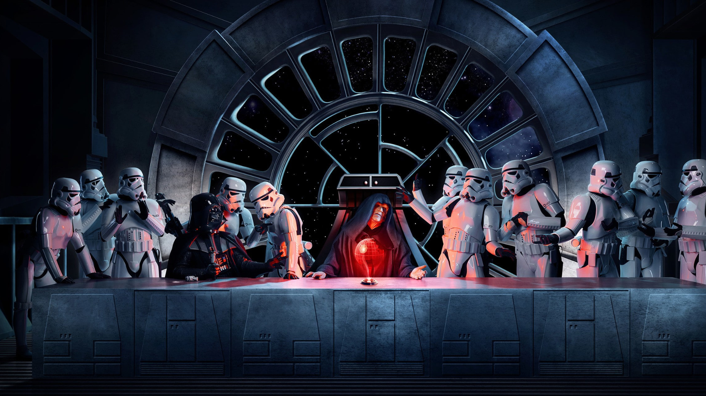

# Tela de Login Star Wars versão 1.0

## ÍNDICE
- <a href="#sobre">Sobre o Projeto</a>   
- <a href="#tecnologias">Tecnologias Utilizadas</a>    
- <a href="#acesse">Acesse Aqui</a> 

## 📝 SOBRE O PROJETO
Apresento minha tela de login inspirada no universo de Star Wars. A ideia é permitir que o usuário faça login ou cadastro para se juntar ao Império de Darth Vader e Palpatine. O projeto não tem integração com banco de dados é apenas, um projeto de estudos que desenvolvi, no início da minha jornada com desenvolvedor Front-end.

Nesse projeto, eu implementei o responsivo para se adaptar diferentes tipos de telas incluindo mobile. 👨‍💻

## 📱 TECNOLOGIAS UTILIZADAS
- HTML
- CSS

## 👇 ACESSE AQUI
Acesse o projeto, nesse link e veja na sua tela <a href="https://deivison556.github.io/TELA-DE-LOGIN-STAR-WARS-versao-1.0/">https://deivison556.github.io/TELA-DE-LOGIN-STAR-WARS-versao-1.0/</a>

